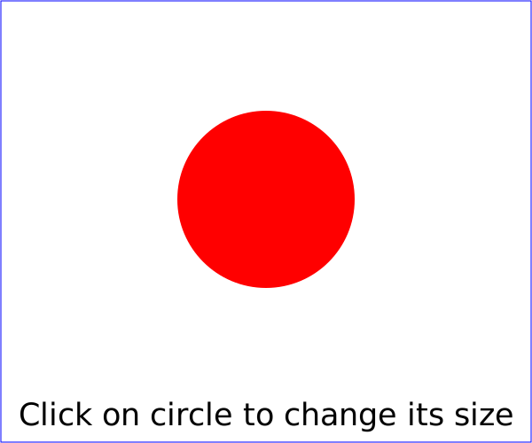

## Hi there 👋

## GitHub Stats &#x1f4c8;

## My work
### *Connected people - CEO*

## GitHub Trophies

## Recent Repos

## Technologies

I'm Lev, a last-year computer science

    Markdown css styles

<label class="switch">
  <input type="checkbox" checked>
  
</label>

All Encompassing Entity Playing
AEEPG
<!--
**LevDoesCode/levdoescode** is a ✨ _special_ ✨ repository because its `README.md` (this file) appears on your GitHub profile.

Here are some ideas to get you started:

- 🔭 I’m currently working on ...
- 🌱 I’m currently learning ...
- 👯 I’m looking to collaborate on ...
- 🤔 I’m looking for help with ...
- 💬 Ask me about ...
- 📫 How to reach me: ...
- 😄 Pronouns: ...
- ⚡ Fun fact: ...
-->
